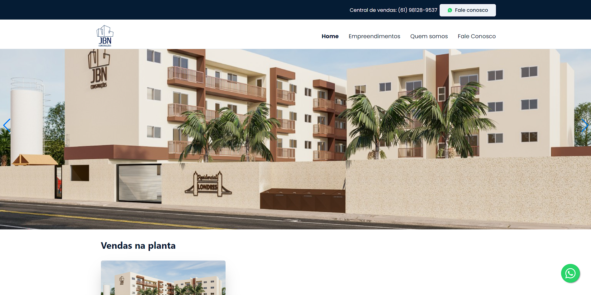
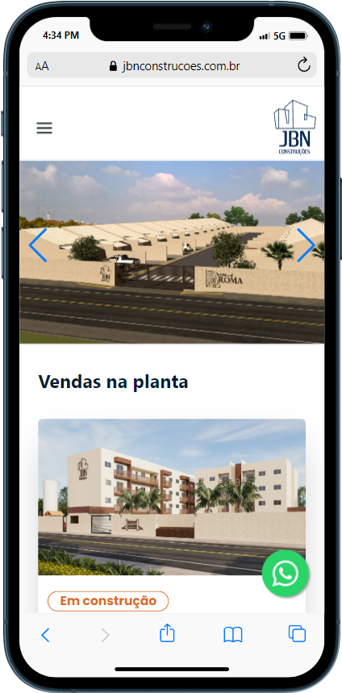
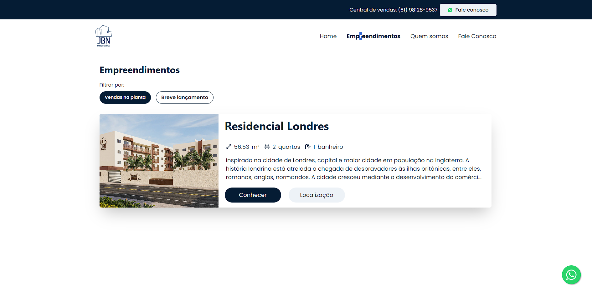
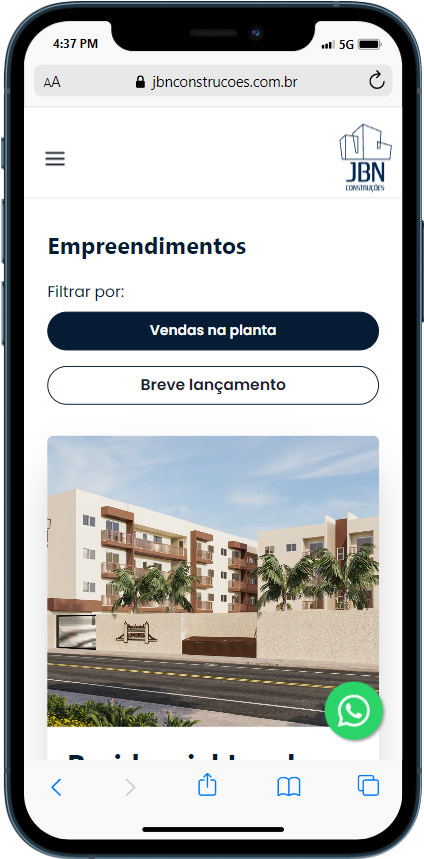
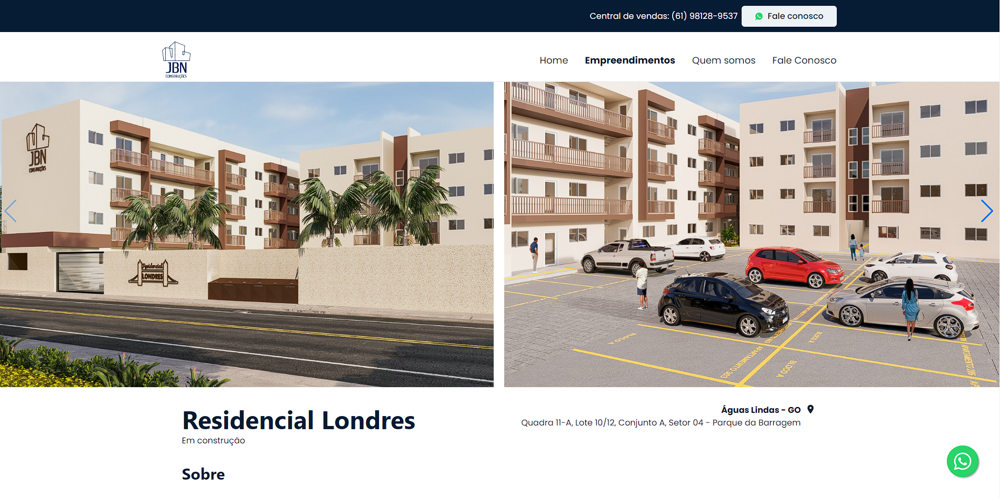
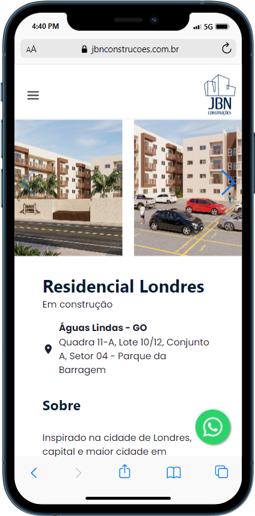
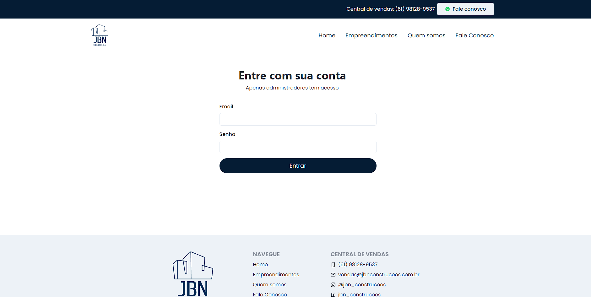
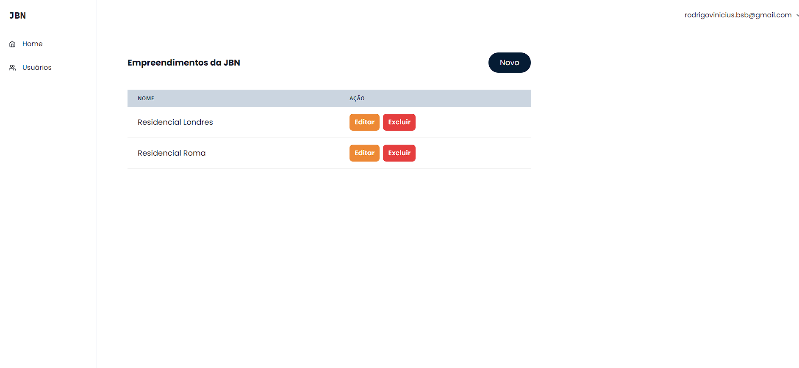

# Sistema de controle dos Empreendimento - Frontend JBN Construções

Um front-end moderno e responsivo desenvolvido com React e Chakra UI para gerenciar os empreendimentos da JBN Construções. Essa é a segunda parte do projeto, onde na primeira foi constuido um backend, confira no link: https://github.com/rodrigoMedeiros0/jbn-backend

## Índice

- [Sistema de controle dos Empreendimento - Frontend JBN Construções](#sistema-de-controle-dos-empreendimento---frontend-jbn-construções)
  - [Índice](#índice)
  - [Tecnologias Utilizadas](#tecnologias-utilizadas)
  - [Funcionalidades](#funcionalidades)
  - [Deploy](#deploy)
  - [Instalação](#instalação)
  - [Imagens da apliacação](#imagens-da-apliacação)
    - [Página Inicial](#página-inicial)
    - [Página Empreendimentos](#página-empreendimentos)
    - [Página Empreendimentos por ID](#página-empreendimentos-por-id)
    - [Página Quem Somos](#página-quem-somos)
    - [Página Contato](#página-contato)
    - [Página de Login](#página-de-login)
    - [Página com Usuário Logado](#página-com-usuário-logado)
  - [Contribuição](#contribuição)
  - [Licença](#licença)

## Tecnologias Utilizadas

- React
- Chakra UI
- Axios (para requisições HTTP)
- React Router (para navegação)

## Funcionalidades

- Interface amigável e responsiva para gerenciamento de empreendimentos
- Visualização de lista de empreendimentos
- Detalhes de cada empreendimento
- Criação, edição e remoção de empreendimentos
- Autenticação de usuários

## Deploy

Este projeto está atualmente em produção e pode ser acessado através do seguinte link:

https://jbnconstrucoes.com.br/


## Instalação

1. Clone o repositório:
   ```bash
   git clone https://github.com/rodrigoMedeiros0/jbn_frontend
   cd jbn_frontend
   crie o arquivo .Env 
   Dentro do.ENV coloque REACT_APP_BACKEND_URL=localhost
   Troque o localhost pela url criada pelo backend no link: https://github.com/rodrigoMedeiros0/jbn-backend
   npm install 
   npm start

## Imagens da apliacação

  ### Página Inicial





 ### Página Empreendimentos






 ### Página Empreendimentos por ID




 ### Página Quem Somos


 ### Página Contato


 ### Página de Login



 ### Página com Usuário Logado



## Contribuição

Contribuições são bem-vindas! Para contribuir com este projeto, siga estas etapas:

1. Fork o repositório
2. Crie uma branch para sua contribuição (`git checkout -b feature/sua-contribuição`)
3. Commit suas mudanças (`git commit -am 'Adicionando nova funcionalidade'`)
4. Push para a branch (`git push origin feature/sua-contribuição`)
5. Abra um Pull Request
   
## Licença

Este projeto está licenciado sob a [MIT License](LICENSE).
